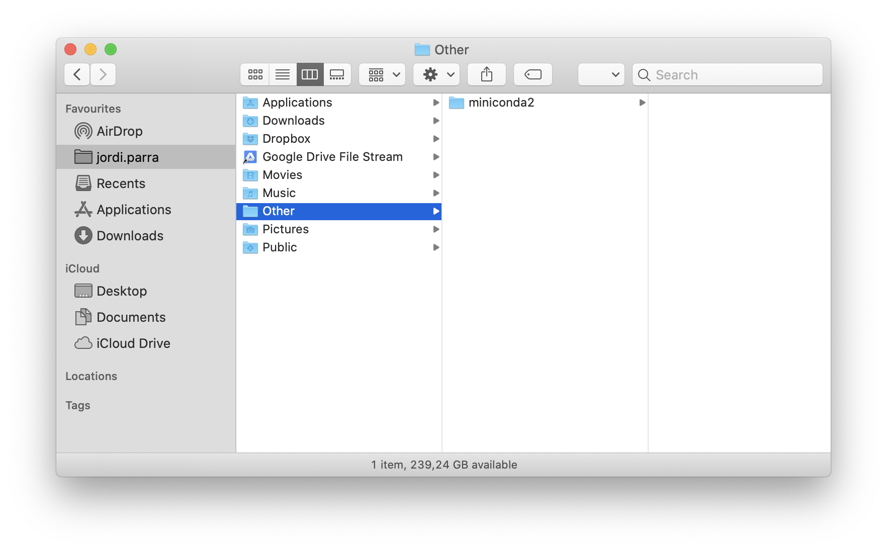
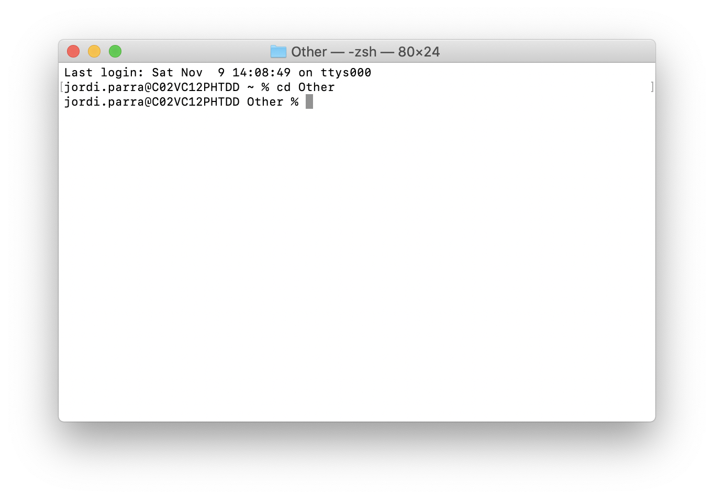
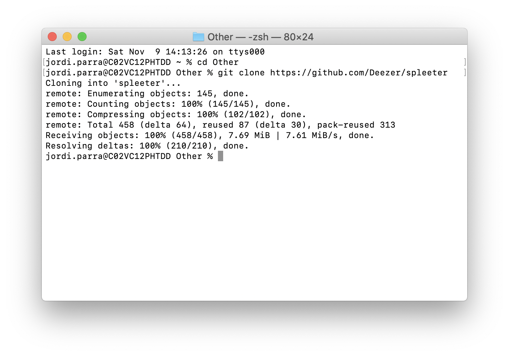
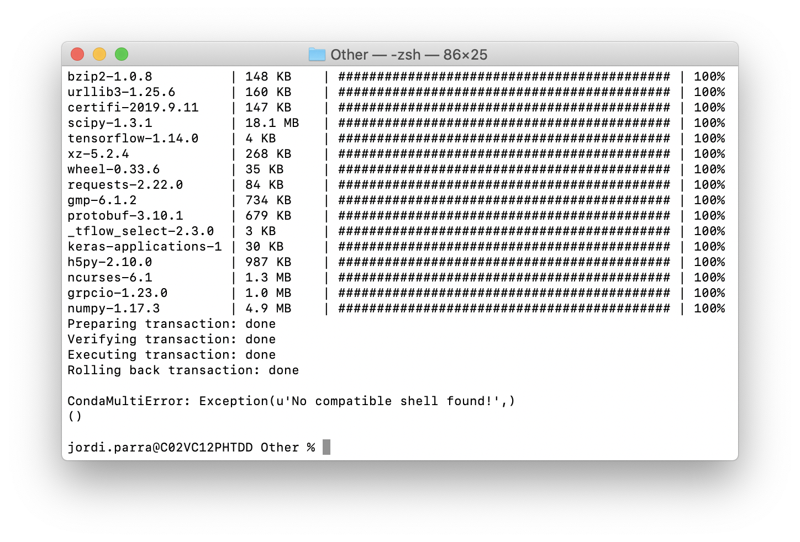
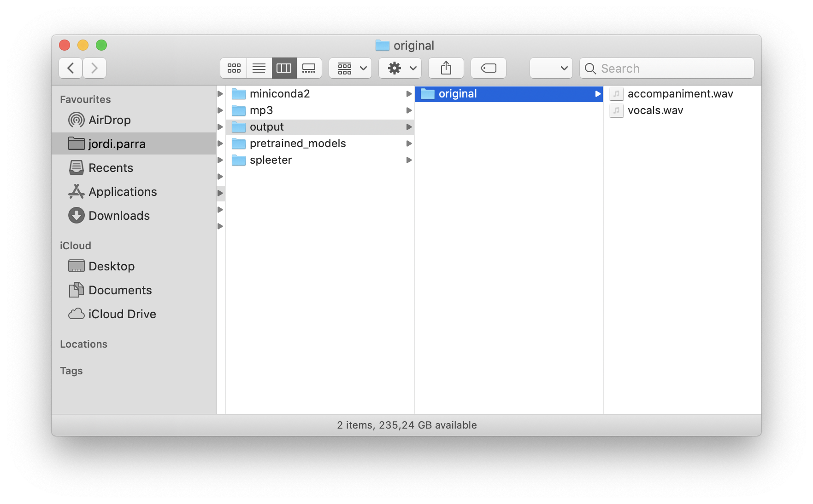

# Spleeter 101 Tutorial

## About

This is a rookie step by step guide to use [Spleeter](https://github.com/deezer/spleeter) on your Mac.

Spleeter is an amazing open-source library by Deezer that separates vocal and music of any given song.

I am no developer myself and I have no relationship with [Deezer](https://www.deezer.com/) nor [Spleeter](https://github.com/deezer/spleeter). There might be mistakes, but as a synth aficionado, I thought it'd be useful to put this tutorial together for non technical folks like me who would like to use it to make cool remixes. 🎉

🐦 If you like it, you can also [follow me on twitter](https://twitter.com/zenona/).

## Requirements

Before using Spleeter, you will have to install Git and Conda. You will only have to install these once. If you are not familiar with running Terminal commands, don't worry, you just need to copy/paste and hit enter.

It might be unfamiliar, but there's nothing here that can break your computer. If you panic, simply close Terminal, open it again and pick up things from the last step.

### Installing Git

1. Check if you have Git installed by opening Terminal and running `git --version`. You simply have to type the command and hit Enter. If you already have git installed, it will return what version you have. Any version will work, but most likely you won't have it installed. If you do, you can jump to the next section and start Installing Miniconda 2.

    

2. If you didn't get a git version back, it means you don't have git installed. If that's the case, [download git for mac](https://sourceforge.net/projects/git-osx-installer/files/) and follow the installer instructions. It'd be very straightforward. Those should be done through a normal interface and there's nothing tricky about it.
3. After completing the installation, quit Terminal and open it again.
4. Run `git --version` and hit Enter. This time you should see that Git is installed. 🎉

### Installing Miniconda 2

1. [Download Miniconda2 MacOSX 64-bit pkg](https://docs.conda.io/en/latest/miniconda.html).

    Make sure you download a version that is compatible with Python 2.7, which already comes with your Mac. If you download the wrong version of Miniconda, Spleeter won't work.

2. Start the installation by opening the package file you just downloaded.
3. In the Destination Select step, choose to install Miniconda 2 in a new folder named `Other` inside your Mac's user folder.

    

4. After completing the installation, open Finder and you'd see that a folder named `/miniconda2` has been created inside the `/Other` folder. It will help keeping all the things you will need to use Spleeter in the same place.

    

5. Once you're done with the installation, make sure you quit Terminal, then open it again and run `export PATH=~/Other/miniconda2/bin`. 
6. After that, run `conda --version`. If Miniconda was installed properly, you'd get back a line of text stating the version you just installed.
7. When running the previous step, you might also be asked to run `conda init zsh`
8. After this, you're done with Miniconda. 🎉

### Installing Spleeter

1. In Terminal, go inside the Other folder you created by rentering  `cd Other` and hiting Enter. You will notice that the header of the Terminal window shows what folder you are at. Make sure you are inside the `/Other` folder you created earlier.

    

    To open a folder you simply have to run `cd foldername`. Going up a folder is `cd ..`

2. Make sure you are in the `/Other` folder in Terminal and run `git clone https://github.com/Deezer/spleeter`. This will download Spleeter from GitHub. This step might take a few seconds.

    

3. You should now see the both the `/spleeter` and `/miniconda2` folders inside the `/Other` folder you created on Finder.

    

### Creating a Conda environment for Spleeter

Spleeter relies on Conda, a data analyzing tool. For it to work, you have to create an environment for Spleeter to work. You will only have to do this once.

1. Go back to Terminal and run `export PATH=~/Other/miniconda2/bin`
2. To make sure that Conda is working properly, running `conda --version` should return the version you installed.
3. In Terminal, you'd be in the `/Other` folder where we left things earlier.
4. To create a Conda environment you just need to run `conda env create -f spleeter/conda/spleeter-cpu.yaml` . Spleeter might take some time to downloading everything it needs. Just let it do its thing. Once it finishes, it should look similar to this:

    

## Using Spleeter

1. Create a `/mp3` folder inside the `/Other` folder you created earlier.
2. Place the .mp3 of the song you want to get separate vocal and music tracks into a folder named `/mp3`. In this example, the mp3 file to split is named `original.mp3`

    

3. Open Terminal
4. Make sure you're inside the `/Other` folder. If you are not, run `cd Other`
5. Now we have to activate the Conda enviromnent by running `conda activate spleeter-cpu`
6. At this point, you can split as many songs as you like by running Spleeter. You just need to run `spleeter separate -i mp3/original.mp3 -p spleeter:2stems -o output`. This step will take a few seconds, just hang on.

    Spleeter has several models. the `2stems` model will generate two tracks, one for vocals, and one for music. But you can also use:
    - `spleeter:4stems` to splkt into vocals, bass, drums and other
    - `spleeter:5stems` to split into vocals / bass / drums / piano / other

7. Once it completes the job, you will get .wav files for each track in a new folder named `/output`  🎉

    
